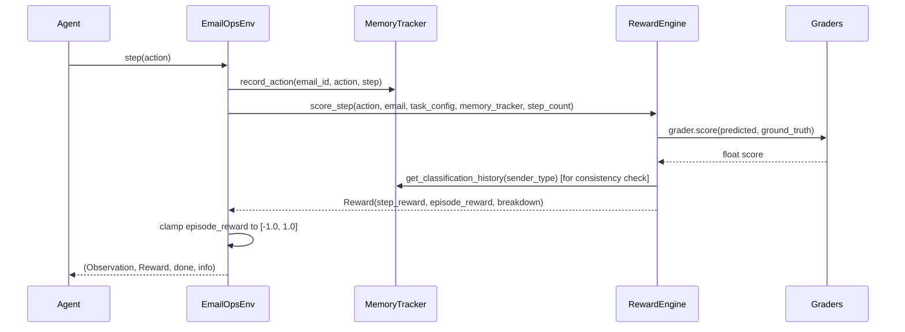
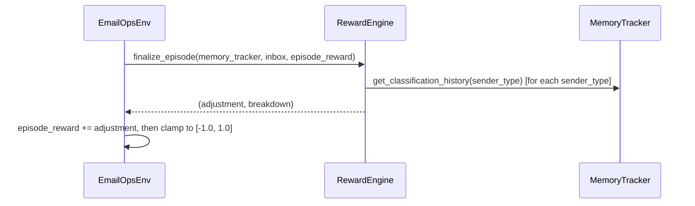

# Design Document: openenv-email-ops-enhancement

## Overview

This document describes the technical design for enhancing the `openenv-email-ops` reinforcement learning environment. The changes span four functional areas — reward signal granularity, hard-task email complexity, cross-email context memory, and grader evaluation quality — while preserving full backward compatibility with the existing OpenEnv interface, `openenv.yaml` schema, and `inference.py` script.

All changes are additive or in-place modifications to existing modules. No new Python packages are introduced. The public API (`step()`, `reset()`, `state()`) remains unchanged.

---

## Architecture

The system retains its existing layered architecture. The enhancement touches five modules:

```
inference.py  (unchanged)
     │
     ▼
EmailOpsEnv  (env.py — minor: passes difficulty to RewardEngine)
     ├── InboxGenerator  (inbox_generator.py — adds Hard_Email_Pool + hard-task selection)
     ├── EpisodeManager  (episode_manager.py — unchanged)
     ├── MemoryTracker   (memory_tracker.py — adds classification_history by sender_type)
     ├── RewardEngine    (reward_engine.py — new reward values, repetition/invalid/consistency/clamp)
     └── Graders         (graders.py — partial scores, 5-criterion ReplyGrader)
```

### Data Flow (per step)



### Episode-End Data Flow



---

## Components and Interfaces

### 1. InboxGenerator (`inbox_generator.py`)

**New: `HARD_EMAIL_POOL`**

A module-level list of at least 5 email template dicts with ambiguous/multi-intent characteristics. Each template follows the same schema as existing `_CUSTOMER_TEMPLATES` etc., but with:
- `urgency_score >= 0.7` paired with `priority = "medium"` or `"low"` (conflicting signal)
- Multi-intent subjects (e.g., "Refund request and product question")
- A new field `dominant_intent: str` used by the hard-task `ReplyGrader`

**Modified: `generate(size, seed, difficulty="easy")`**

The `generate` method gains an optional `difficulty` parameter (default `"easy"` for backward compatibility). When `difficulty == "hard"`, at least 40% of emails are drawn from `HARD_EMAIL_POOL`.

```python
def generate(self, size: int, seed: int, difficulty: str = "easy") -> list[Email]:
    ...
    if difficulty == "hard":
        hard_count = max(1, math.ceil(size * 0.4))
        # fill hard_count slots from HARD_EMAIL_POOL, rest from normal pool
```

The `Email` model gains an optional `dominant_intent: str | None = None` field used only for hard-task emails.

**Interface change summary:**
- `generate()` signature: adds `difficulty: str = "easy"` (backward compatible)
- `Email` model: adds `dominant_intent: str | None = None` (backward compatible, Pydantic optional)

---

### 2. MemoryTracker (`memory_tracker.py`)

**New internal state:**

```python
# Maps sender_type -> list of classification values (in order applied)
self._classification_history: dict[str, list[str]] = {}
```

**New public method:**

```python
def get_classification_history(self, sender_type: str) -> list[str]:
    """Return all classification values applied to emails of sender_type in this episode."""
    return list(self._classification_history.get(sender_type, []))
```

**Modified: `record_action()`**

When `action.action_type == "classify_email"`, also append `action.value` to `_classification_history[sender_type]`. The caller (`env.py`) must pass `sender_type` alongside the action. This requires a small signature change:

```python
def record_action(self, email_id: str, action: Action, step: int, sender_type: str | None = None) -> None:
```

The `sender_type` parameter is optional (default `None`) for backward compatibility.

**Modified: `reset()`**

Clears `_classification_history` in addition to existing state.

**Memory complexity:** O(n) where n = inbox size, since each email contributes at most one classification entry.

---

### 3. Graders (`graders.py`)

#### ClassificationGrader

Replaces binary scoring with a three-tier adjacency map:

```
exact match  → 1.0
adjacent     → 0.5   ("promotion" ↔ "important")
no match     → 0.0   ("spam" is not adjacent to either)
```

```python
_CLASSIFICATION_ADJACENCY: dict[str, set[str]] = {
    "important": {"promotion"},
    "promotion": {"important"},
    "spam": set(),
}

def score(self, predicted: str, ground_truth: str) -> float:
    p, g = predicted.strip().lower(), ground_truth.strip().lower()
    if p == g:
        return 1.0
    if p in _CLASSIFICATION_ADJACENCY.get(g, set()):
        return 0.5
    return 0.0
```

#### PrioritizationGrader

Three-tier adjacency:

```
exact match  → 1.0
adjacent     → 0.5   ("high"↔"medium", "medium"↔"low")
two-level    → 0.0   ("high"↔"low")
```

```python
_PRIORITY_ADJACENCY: dict[str, set[str]] = {
    "high": {"medium"},
    "medium": {"high", "low"},
    "low": {"medium"},
}
```

#### RoutingGrader

Unchanged: 1.0 for exact match, 0.0 for any mismatch (routes are categorically distinct).

#### ReplyGrader

Expands from 4 criteria (0.25 each) to 5 criteria (0.2 each):

| # | Criterion | Weight |
|---|-----------|--------|
| 1 | Reply length >= 30 characters | 0.2 |
| 2 | Presence of a greeting | 0.2 |
| 3 | Relevance to email subject keywords | 0.2 |
| 4 | Absence of placeholder text | 0.2 |
| 5 | Reply length >= 80 characters (substantive) | 0.2 |

For hard-task emails, an additional check is applied: the reply must reference the `dominant_intent` keyword from the email. This is implemented as a separate `score_hard()` method that wraps `score()` and adds the dominant-intent check as a 0.25 weight modifier on top of the base 5-criterion score:

```python
def score_hard(self, reply: str, email: Email) -> float:
    base = self.score(reply, email)
    if email.dominant_intent and email.dominant_intent.lower() in reply.lower():
        return min(1.0, base + 0.25)
    return base
```

The `score()` method signature is unchanged (backward compatible).

---

### 4. RewardEngine (`reward_engine.py`)

This is the most significantly changed component. Key changes:

#### Updated reward values (Req 15)

| Action | Condition | Old value | New value |
|--------|-----------|-----------|-----------|
| classify_email | correct | +0.2 | +0.4 |
| classify_email | incorrect | -0.2 | -0.2 (unchanged) |
| prioritize_email | correct | +0.2 | +0.2 (unchanged) |
| prioritize_email | incorrect | 0.0 | 0.0 (unchanged) |
| route_email | correct | +0.2 | +0.2 (unchanged) |
| generate_reply | any | raw * 0.2 | raw * 0.2 (unchanged, but raw now uses 5-criterion grader) |

#### New: Repetition penalty (Req 15.7)

In `score_step()`, before scoring, check if the same `action_type` has already been applied to this email in the current episode:

```python
prior_actions = memory_tracker.get_actions_for_email(email.id)
is_duplicate = any(a.action_type == action.action_type for a, _ in prior_actions)
if is_duplicate:
    breakdown["repetition_penalty"] = -0.1
    total += -0.1
```

#### New: Invalid-action penalty (Req 15.8)

```python
_VALID_VALUES = {
    "classify_email": {"spam", "important", "promotion"},
    "prioritize_email": {"low", "medium", "high"},
    "route_email": {"support", "sales", "escalation"},
}

if action.action_type in _VALID_VALUES:
    if (action.value or "").strip().lower() not in _VALID_VALUES[action.action_type]:
        breakdown["invalid_action"] = -0.1
        total += -0.1
        return Reward(step_reward=total, episode_reward=0.0, breakdown=breakdown)
```

#### New: Consistency penalty (Req 17.3)

After recording the action, if `action_type == "classify_email"`:

```python
history = memory_tracker.get_classification_history(email.sender_type)
if len(history) >= 2:
    prior = history[-2]  # previous classification for this sender_type
    current = history[-1]
    if prior != current:
        breakdown["consistency_penalty"] = -0.1
        total += -0.1
```

#### New: Reasoning consistency bonus/penalty for hard task (Req 16.5, 16.6)

Tracked per-email in `MemoryTracker`. After a complete 4-step sequence (classify → prioritize → route → reply) on a single email in the hard task:

```python
def _check_reasoning_consistency(self, email_id: str, memory_tracker: MemoryTracker) -> float:
    """Return +0.15 for coherent sequence, -0.15 for contradictory, 0.0 otherwise."""
    actions = {a.action_type: a.value for a, _ in memory_tracker.get_actions_for_email(email_id)}
    if not all(k in actions for k in ["classify_email", "route_email"]):
        return 0.0
    classification = actions["classify_email"]
    route = actions["route_email"]
    # Contradiction: spam classified but routed to escalation
    if classification == "spam" and route == "escalation":
        return -0.15
    # Coherent: important + escalation, or spam + support, etc.
    coherent_pairs = {("important", "escalation"), ("important", "sales"), ("important", "support"),
                      ("spam", "support"), ("promotion", "sales")}
    if (classification, route) in coherent_pairs:
        return 0.15
    return 0.0
```

This is called at the end of each step when `task_config.difficulty == "hard"` and the email has had all 4 action types applied.

#### New: Episode reward clamping (Req 15.9)

In `env.py`, after accumulating `self._episode_reward`:

```python
self._episode_reward = max(-1.0, min(1.0, self._episode_reward))
```

Applied after every step and after `finalize_episode()`.

#### New: Consistency bonus at episode end (Req 17.4)

In `finalize_episode()`, for each sender_type with a classification history:

```python
for sender_type, history in memory_tracker.get_all_classification_histories().items():
    if len(history) >= 2 and len(set(history)) == 1:
        # All consistent — check if they match ground truth
        # (ground truth lookup requires passing inbox emails)
        if all_correct_for_sender_type(sender_type, history[0], inbox):
            breakdown[f"consistency_bonus_{sender_type}"] = 0.2
            total += 0.2
```

This requires `MemoryTracker` to expose `get_all_classification_histories() -> dict[str, list[str]]`.

---

### 5. EmailOpsEnv (`env.py`)

**Modified: `reset()`**

Passes `difficulty` to `InboxGenerator.generate()`:

```python
inbox = self._inbox_generator.generate(
    self._inbox_size, self._seed, difficulty=self._task_config.difficulty
)
```

**Modified: `step()`**

- Passes `sender_type` to `memory_tracker.record_action()`
- Applies episode reward clamping after each step and after `finalize_episode()`
- Passes `task_config` to `finalize_episode()` for consistency bonus ground-truth lookup

No changes to method signatures or return types.

---

## Data Models

### Modified: `Email` (models.py)

```python
class Email(BaseModel):
    id: str
    subject: str
    body: str
    sender_type: Literal["customer", "spammer", "VIP", "internal"]
    urgency_score: float
    ground_truth: GroundTruth
    dominant_intent: str | None = None  # NEW: used for hard-task reply scoring
```

The `dominant_intent` field is optional with a default of `None`, so all existing code that constructs `Email` objects without this field continues to work.

### Unchanged: `Action`, `Observation`, `Reward`, `TaskConfig`, `EpisodeInfo`, `InboxSummary`

All existing model schemas are preserved. No fields are removed or renamed.

---

## Correctness Properties

*A property is a characteristic or behavior that should hold true across all valid executions of a system — essentially, a formal statement about what the system should do. Properties serve as the bridge between human-readable specifications and machine-verifiable correctness guarantees.*

### Property 1: Correct classification reward

*For any* email with a known ground truth classification, when the agent classifies it correctly, the `breakdown["classification"]` component of the step reward SHALL equal +0.4.

**Validates: Requirements 15.1**

---

### Property 2: Incorrect classification penalty

*For any* email, when the agent classifies it with a label that does not match the ground truth, the `breakdown["classification"]` component SHALL equal -0.2.

**Validates: Requirements 15.2**

---

### Property 3: Reply reward is bounded

*For any* reply string and any email, the `breakdown["reply"]` component of the step reward SHALL be in the range [0.0, 0.2].

**Validates: Requirements 15.5**

---

### Property 4: Repetition penalty on duplicate actions

*For any* email and any action type, if the same action type is applied to the same email more than once in an episode, each application beyond the first SHALL incur a `breakdown["repetition_penalty"]` of -0.1.

**Validates: Requirements 15.7**

---

### Property 5: Invalid action penalty

*For any* action with a value not in the valid set for its action type (e.g., `classify_email` with value `"unknown"`), the step reward breakdown SHALL include `"invalid_action": -0.1`.

**Validates: Requirements 15.8**

---

### Property 6: Episode reward clamping invariant

*For any* sequence of actions in any episode, the cumulative `episode_reward` returned in the `Reward` object SHALL always satisfy `-1.0 <= episode_reward <= 1.0`.

**Validates: Requirements 15.9**

---

### Property 7: Hard task inbox pool proportion

*For any* seed and inbox size >= 5 when generating a hard-task inbox, at least 40% of the generated emails SHALL originate from the `HARD_EMAIL_POOL`.

**Validates: Requirements 16.2**

---

### Property 8: Classification history round-trip

*For any* sequence of classify_email actions applied to emails of a given sender_type, `memory_tracker.get_classification_history(sender_type)` SHALL return exactly those classification values in the order they were applied.

**Validates: Requirements 17.1, 17.5**

---

### Property 9: Consistency penalty on divergent classifications

*For any* two emails of the same sender_type classified with different labels in the same episode, the step reward for the second classification SHALL include `"consistency_penalty": -0.1`.

**Validates: Requirements 17.3**

---

### Property 10: Memory cleared on reset

*For any* episode with recorded classification history, calling `env.reset()` SHALL result in `memory_tracker.get_classification_history(sender_type)` returning an empty list for all sender types.

**Validates: Requirements 17.7**

---

### Property 11: Grader determinism

*For any* pair of (predicted, ground_truth) inputs, calling any grader's `score()` method twice with the same inputs SHALL return the same float value both times.

**Validates: Requirements 18.5**

---

### Property 12: ClassificationGrader adjacency scoring

*For any* (predicted, ground_truth) pair, the ClassificationGrader SHALL return 1.0 for exact match, 0.5 when predicted and ground_truth are in the defined adjacency set, and 0.0 otherwise.

**Validates: Requirements 18.1, 18.6**

---

### Property 13: PrioritizationGrader adjacency scoring

*For any* (predicted, ground_truth) priority pair, the PrioritizationGrader SHALL return 1.0 for exact match, 0.5 for adjacent levels, and 0.0 for a two-level mismatch.

**Validates: Requirements 18.2, 18.7**

---

### Property 14: ReplyGrader score is a multiple of 0.2

*For any* reply string and any email, the ReplyGrader's `score()` SHALL return a value in `{0.0, 0.2, 0.4, 0.6, 0.8, 1.0}` (i.e., a multiple of 0.2 in [0.0, 1.0]).

**Validates: Requirements 18.4**

---

## Error Handling

### Grader errors

All grader calls in `RewardEngine.score_step()` remain wrapped in `try/except`. On exception, the component score defaults to 0.0 and a warning is logged. This is unchanged from the existing implementation.

### Invalid action values

Invalid action values are caught before grader invocation and return early with the -0.1 penalty. This prevents graders from receiving unexpected inputs.

### MemoryTracker key misses

All `MemoryTracker` lookups use `.get()` with safe defaults. Missing keys return empty lists or `None`, never raising `KeyError`.

### Episode reward clamping

Clamping is applied unconditionally after every step and after `finalize_episode()`, ensuring the invariant holds even if individual bonuses/penalties are unexpectedly large.

### Hard-task dominant intent

If `email.dominant_intent` is `None` (e.g., a non-hard-pool email slips through), `score_hard()` falls back to the base `score()` result without error.

---

## Testing Strategy

### Unit tests (example-based)

- `test_graders.py`: Verify specific adjacency pairs for ClassificationGrader and PrioritizationGrader (e.g., `("promotion", "important") → 0.5`, `("spam", "important") → 0.0`). Verify 5-criterion ReplyGrader with concrete replies.
- `test_reward_engine.py`: Verify repetition penalty, invalid-action penalty, consistency penalty, reasoning consistency bonus/penalty with concrete action sequences.
- `test_memory_tracker.py`: Verify `get_classification_history()` with concrete sequences, verify `reset()` clears history.
- `test_inbox_generator.py`: Verify hard-task pool size >= 5, verify conflicting-signal templates exist.

### Property-based tests (Hypothesis)

The project already uses Hypothesis (`.hypothesis/` directory present). Property tests use `@given` with `hypothesis.strategies`.

Each property test runs a minimum of 100 iterations. Tests are tagged with:
`# Feature: openenv-email-ops-enhancement, Property N: <property_text>`

**Targeted properties:**

- **Property 1 & 2**: Generate random `Email` objects with known ground truth; verify classification reward values.
- **Property 3**: Generate random reply strings and emails; verify reply reward in [0.0, 0.2].
- **Property 4**: Generate random emails and action types; apply same action twice; verify repetition penalty.
- **Property 5**: Generate invalid action values for each action type; verify invalid-action penalty.
- **Property 6**: Generate random action sequences; run full episodes; verify episode_reward in [-1.0, 1.0].
- **Property 7**: Generate random seeds and inbox sizes >= 5; verify hard-pool proportion >= 0.4.
- **Property 8**: Generate random sender_types and classification sequences; verify round-trip.
- **Property 9**: Generate two emails of same sender_type with different labels; verify consistency penalty.
- **Property 10**: Generate episodes with classification history; call reset(); verify empty history.
- **Property 11**: Generate random grader inputs; call each grader twice; verify equal results.
- **Property 12 & 13**: Generate random (predicted, ground_truth) pairs; verify adjacency scoring.
- **Property 14**: Generate random replies and emails; verify score is multiple of 0.2.

### Integration / smoke tests

- **Req 19.1**: Time a full `--dry-run` inference across all three tasks; assert < 20 minutes.
- **Req 19.2**: Assert `requirements.txt` is unchanged (no new packages).
- **Req 19.3–19.5**: Run existing test suite; assert no regressions.
- **Req 19.7**: Time `score_step()` calls; assert < 10ms per step.
